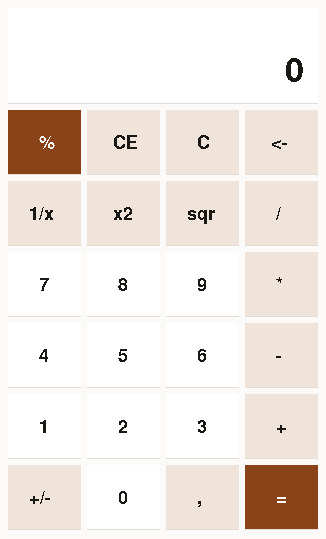
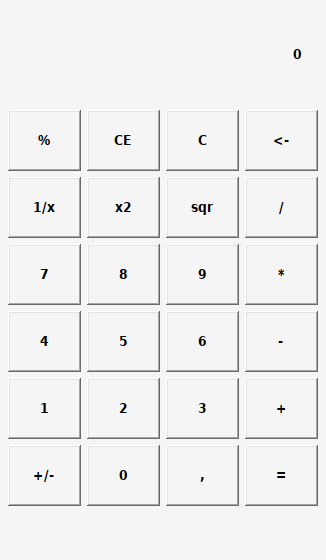

# Calculator

**The same calculator five times: two on X11, three on Win32 — no toolkit, no library, and
no dependency of any kind.**

| | | |
|---|---|---|
|  |  |  |
| **x11-protocol** — every pixel over a socket | **win32-controls** — Windows draws the buttons | **win32-owner-drawn** — every key painted here |

Five interfaces, one arithmetic core, and nothing linked in. Each version is a complete,
self-contained example: its own copy of everything, so you can lift one directory out and it
builds.

**[docs/README.md](docs/README.md) is the guided tour** — what each one demonstrates, in the
order they are worth reading.

## The numbers

One laptop (Intel Core Ultra 7 258V, 6 cores, 16 GB), 15 September 2026. Compile times are
the best of ten runs on an otherwise idle machine, compiled one after another. Startup is
measured from `exec` to a window actually mapped on screen, not to the process starting.

**Measure these with nothing else running.** The same figures came out at 7–10 ms while a
handful of test windows were still open — more than twice as slow, and nothing to do with the
code.

| | x11-protocol | x11-separated | win32-controls | win32-owner-drawn | win32-separated |
|---|---:|---:|---:|---:|---:|
| **compile time** | **3 ms** | **3 ms** | **4 ms** | **4 ms** | **4 ms** |
| source, total | 701 lines | 703 lines | 673 lines | 919 lines | 787 lines |
| **source, the application file** | 485 | **120** | 457 | 703 | **98** |
| files | 2 | **4** | 2 | 2 | **4** |
| low-level constructs in the application file | many | **0** | many | many | **0** |
| **binary** | **39,025 B** | **42,666 B** | **78,848 B** | **89,088 B** | **86,528 B** |
| statically linked | **yes** | **yes** | no | no | no |
| dynamically linked libraries | **none** | **none** | 5 DLLs | 5 DLLs | 5 DLLs |
| third-party libraries | **none** | **none** | **none** | **none** | **none** |
| imported functions | — | — | 54 | 67 | 65 |
| resident memory | **68 kB** | 80 kB | — | — | — |
| peak working set, native Windows | — | — | 11,884 kB | 11,924 kB | 11,928 kB |
| start to a mapped window, native Linux | **10–11 ms** | **10–11 ms** | — | — | — |
| start to a mapped window, **native Windows** | — | — | **52 ms** | **39 ms** | **42 ms** |
| the same, measured from outside under Wine | — | — | ~660 ms | ~660 ms | ~660 ms |

**The two rows that carry the argument are "the application file" and the one under it.**
Every version does exactly the same thing. Moving the platform into layers takes the file you
would actually work in from 703 lines to 98 — and the total barely moves, because the work
did not go away, it went somewhere you stop reading.

The row below it is the stricter test. "Separated" is easy to claim and easy to get wrong: the
first version of `x11-separated` still had `sys3(SYS.read, ...)` and event-byte arithmetic in
its application file, which read as separated and was not. That row is a count of `sys`,
`winapi`, `addr`, `chr`, `ord` and byte pokes — and it is zero for both, which is the claim
this demo is actually making.

Four things want a word rather than a number:

**Static against dynamic is not a fair row, and saying "none" twice would hide that.** The
X11 builds are statically linked in the literal sense: `file` says *statically linked*, there
is no dynamic section and no interpreter, so nothing is loaded at start. A PE cannot work
that way — a Windows program reaches the operating system through DLLs the loader resolves
before the first instruction, and that is true of every Windows binary. What both sides share
is the row that matters: **no third-party libraries**. No libc, no libX11, no toolkit, no
runtime.

**Wine is not a proxy for Windows, and the gap is a factor of five to fifteen.** The same
executables were run in Windows Sandbox on a Windows 11 host: 39–52 ms to a window, against
~660 ms measured from outside under Wine and ~136–250 ms measured by the programs themselves
there. A window with nothing in it — one `RegisterClassEx`, one `CreateWindowEx`, an empty
message loop, 46,592 bytes — also measures ~660 ms under Wine, which is what shows that the
figure is Wine's process startup rather than anything these programs do.

So the Windows column is the real one, and the Wine row is kept only because it is the number
anyone developing on Linux will see.

The Windows figures are the lowest of the runs recorded in
[`docs/measurements/native-windows.md`](docs/measurements/native-windows.md), which keeps
every measurement rather than only the one that was quoted.

**The Windows builds measure themselves**, which is how the numbers above were obtained on a
machine with nothing installed. Each writes its startup time and peak working set into its own
title bar and into a text file beside itself, using `GetSystemTimeAsFileTime` and
`GetProcessMemoryInfo` from `psapi.dll` — a DLL the compiler has never heard of, named in the
source like any other.

The clock can only start at the program's own first instruction, so this **excludes the
operating system's process startup**. An external stopwatch measures more, and therefore
something else; both are honest about different things.

**The two memory rows are not comparable, and are deliberately kept apart.** The X11 figure is
resident set on Linux, 68 kB. The Windows figure is peak working set, ~11.9 MB — and almost
all of that is the address space a GUI process gets on Windows before any of this code runs.
Putting them in one row would suggest a difference between the programs where the difference
is between the operating systems.

## What it does

Four operators, chaining, percent, sign, backspace, clear and clear-entry, plus `1/x`, `x²`
and `√`. The line above the digits shows the sum you are in the middle of, the way every
calculator does.

**Whole numbers only, and that is a choice.** There is no floating point anywhere, so every
answer is exact and `√10` is `3`. A calculator that quietly rounds is worse than one that
says what it does.

Refusals say which refusal: `cannot divide by zero` and `no root of a negative` are
different messages, because a reader cannot tell them apart otherwise.

## The layout

```
src/x11-protocol/       the X11 wire protocol by hand
src/x11-separated/      the same in three layers: main / widgets / x11
src/win32-controls/     the system's own BUTTON controls
src/win32-owner-drawn/  every key painted by the program
src/win32-separated/    the same in three layers: main / widgets / win32
tests/                  the arithmetic, checked headless
```

Every directory carries its own `calc.wz`: the arithmetic, which knows nothing about a
screen. It takes key presses and answers with what the display should read, so it is tested
without a window — and it is why writing the fifth front end cost a few hundred lines rather
than starting over.

**The copies are deliberate.** These are examples, and an example that only builds inside its
own repository teaches you where the other files live rather than how the thing works.

### What measuring these found, and where it went

There were two empty directories here for a while, `win32-optimized/` and `x11-optimized/`,
waiting for a tuned version. They are gone, and the reason is the more interesting result.

Measuring these binaries turned up something that is not an implementation question at all:
**a quarter of every binary is error messages.** Six unique sentences — array index out of
range, division by zero, and four more — stored 345 times, because each one carries its own
file name and line number:

```
runtime error: array index out of range at src/win32-owner-drawn/main.wz:107
runtime error: array index out of range at src/win32-owner-drawn/main.wz:108
```

24,409 bytes of a 96,256-byte binary. The X11 build shows the same 27%, and the compiler
itself carries 63 kB of it.

That is the price of the guarantee this language makes — every array access is bounds-checked
— and it had never been measured. It is also largely recoverable without giving the guarantee
up: store each sentence once and keep a small table of file and line, and the same information
fits in about 1,750 bytes.

**That is compiler work, not something an example can demonstrate**, which is why the
directories are gone rather than filled. Nothing was left to optimise in the implementations
that would have been worth reading.

## Building and running

```bash
wantzel src/x11-protocol/main.wz      bin/x11-protocol      && ./bin/x11-protocol
wantzel src/x11-separated/main.wz     bin/x11-separated
wantzel src/win32-controls/main.wz    bin/win32-controls.exe    --target=windows
wantzel src/win32-owner-drawn/main.wz bin/win32-owner-drawn.exe --target=windows
wantzel src/win32-separated/main.wz   bin/win32-separated.exe   --target=windows

./wzttest        # the arithmetic, headless
```

The X11 versions need an X server on `/tmp/.X11-unix/X0`; under WSL2 that is WSLg, and the
window appears on the Windows desktop like any other. Escape closes them.

## What it is not

- **The X11 text is not anti-aliased.** X11 core fonts are one bit per pixel — a property of
  the 1987 protocol, not of these programs. Smooth text there needs the XRender extension,
  which means rendering glyphs yourself. The Win32 versions ask for ClearType and get it.
- **No decimals.** Exact or nothing; see above.
- **No keyboard input yet**, beyond Escape to close the X11 windows.
- **No memory keys.** The Windows 11 calculator has a row of them; these do not.
- **Nothing is optimised**, and measuring these is what showed the worthwhile
  optimisation is in the compiler rather than here. See above.
