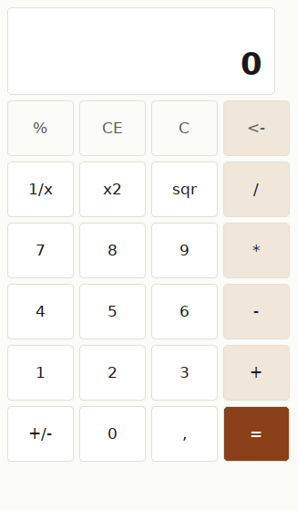

# win32-owner-drawn — taking the drawing back

**What this shows:** what it costs to stop looking like the platform default. Every key here
is `BS_OWNERDRAW`, so Windows draws nothing and asks the program to do it — and everything a
themed button would have given for free becomes work.



*The same calculator, painted by the program: rounded surfaces, the house palette, and a
pressed key that shrinks by one pixel.*

## What it demonstrates about GUIs in Wantzel

That the ceiling is the platform's, not the language's. Nothing here is a special capability
of Wantzel — it is GDI calls named in the source, the same way any other Windows API is
reached. `CreateSolidBrush`, `RoundRect`, `SelectObject`, `DrawTextA`, `CreateFontA`: none of
them is in the compiler.

It also shows that **a modern-looking Windows program is not only code.** Two of the three
things that separate 1995 from today are not calls at all:

1. **A manifest.** Windows ships two versions of its controls and gives you the 1995 one
   unless an application manifest asks for version 6. Themed controls are a *file you ship*,
   not a flag you set.
2. **A font.** The default for a control is the System font from Windows 95. Segoe UI has to
   be created with `CreateFontA` and assigned to every control.
3. Colour, which is the part that is code.

## How it works

```
BS_OWNERDRAW        on every button, so the system stops drawing
WM_DRAWITEM         arrives per key: a DRAWITEMSTRUCT with the state and a device context
WM_ERASEBKGND       the window's own surface, painted rather than left to a system brush
WM_CTLCOLORSTATIC   so the display labels do not paint a grey box behind themselves
TrackMouseEvent     because Windows does not say "the mouse left" unless asked
```

## The details that cost time

**For a button the identifier is `CtlID` at offset 4, not `itemID` at offset 8.** `itemID` is
for a list or menu item and stays 0 — which draws every key in the grid with the same label
and looks like a string-buffer bug rather than a wrong offset. That cost an hour.

**Win32 wants `0x00BBGGRR`, not `#rrggbb`.** The bytes are reversed against the palette as it
is written down. Getting it wrong gives colours that look almost right, which is worse than
obviously wrong.

**The painter needs its own text buffer.** Sharing one with the code that creates the windows
means the last label written is the one every key shows.

**`RoundRect` takes the corner diameter, not the radius.**

**Hover needs re-arming on every move.** `TrackMouseEvent` fires `WM_MOUSELEAVE` once; without
re-arming it, a key stays lit after the pointer has gone.

## The micro-detail that is worth the trouble

A pressed key loses one pixel on every side before it is drawn, so it reads as going *into*
the surface rather than merely changing colour. It is two lines and it is the difference
between a button and a coloured rectangle.

## What it measures about itself

The program writes its own startup time and peak working set into its title bar and into a
text file beside itself, using `GetSystemTimeAsFileTime` and `GetProcessMemoryInfo` from
`psapi.dll` — a DLL the compiler has never heard of, named in the source like any other.

On Windows 11, in Windows Sandbox with nothing installed: **39 ms** to a window on screen,
11,924 kB peak working set. The same executable under Wine on Linux reports ~250 ms, and
measured with a stopwatch from outside, ~660 ms — of which almost all is Wine starting a
process, because an empty window measures the same there.

The clock can only start at the program's own first instruction, so this excludes the
operating system's process startup. Every run is kept in
[`../measurements/native-windows.md`](../measurements/native-windows.md).
