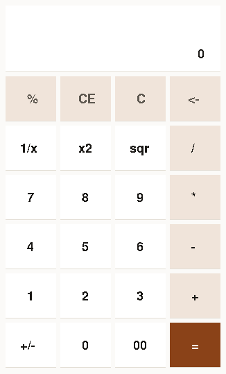

# x11-separated — the same split, on the other platform

**What this shows:** that separating the application from the platform is a property of the
approach, not something Windows forced. The protocol lives in `x11.wz`; `main.wz` describes a
calculator.



*The X11 version with the protocol one file down — same window, different structure.*

## What it demonstrates about GUIs in Wantzel

Put this next to `win32-separated` and the two application files look almost the same:

```pascal
place("7",   2, 0, 0 - 7,   C_CARD, C_FG);     // x11-separated
place("7",   2, 0, 0 - 7,   WK.CARD, WK.INK);  // win32-separated
```

The layers underneath have nothing in common — one writes X11 requests to a socket, the other
calls DLL functions and receives callbacks — and that difference does not reach the
application. That is the whole argument for the split, and it is more convincing here than on
one platform alone.

## Three layers, and the same three on both platforms

```
main.wz       the calculator: which keys exist, what each means, what to show
widgets.wz    keys, a grid, the event loop
x11.wz        the protocol: requests, resource ids, the socket
calc.wz       the arithmetic
```

`win32-separated` has exactly the same four files, with `win32.wz` in place of `x11.wz`. That
is the point of having both: the bottom layers have nothing in common — one writes X11
requests to a socket, the other calls DLL functions and receives callbacks — and by the time
you reach `main.wz` that difference is gone.

**Both application files contain zero low-level constructs.** No `sys3`, no `winapi`, no
`addr`, no `chr`, no byte offsets. Counted, not asserted.

### Where the platforms still genuinely differ

Inside `widgets.wz`, and only there:

- **On X11 the program reads events.** `ui.run` is a loop around `sys3(SYS.read, ...)` that
  pulls 32-byte events off the socket and decodes them.
- **On Windows the system calls you.** `win.run` pumps messages, and the clicks arrive
  separately in a window procedure that the system calls directly.

Hiding *that* difference too would mean inventing an event abstraction over both, which is
what a toolkit is. These examples deliberately stop one layer short.

## The details that cost time

**The library must not know the application's constants.** The first version of `x11.wz`
still referenced `W`, `H` and `C_BG` from the calculator, which compiled only because they
happened to be in scope. They are parameters of `x.open` now — and the compiler's error
pointed at `http.wz`, because a global called `W` exists there too.

**Extracting a layer is not moving text.** Routines that used file-level globals need those
globals renamed into the namespace or turned into locals, and the main block that came along
by accident has to go.

**A "separated" version can still leak the platform, and you only see it by counting.** The
first version of this directory had the event loop in `main.wz`: `sys3(SYS.read, ...)`,
`ord(x.ev[0]) mod 128`, coordinates pulled from offsets 24 and 26. It read as separated
because the protocol was elsewhere, and it was not. Grep the application file for `sys`,
`addr`, `chr` and `ord`; the answer should be zero.
