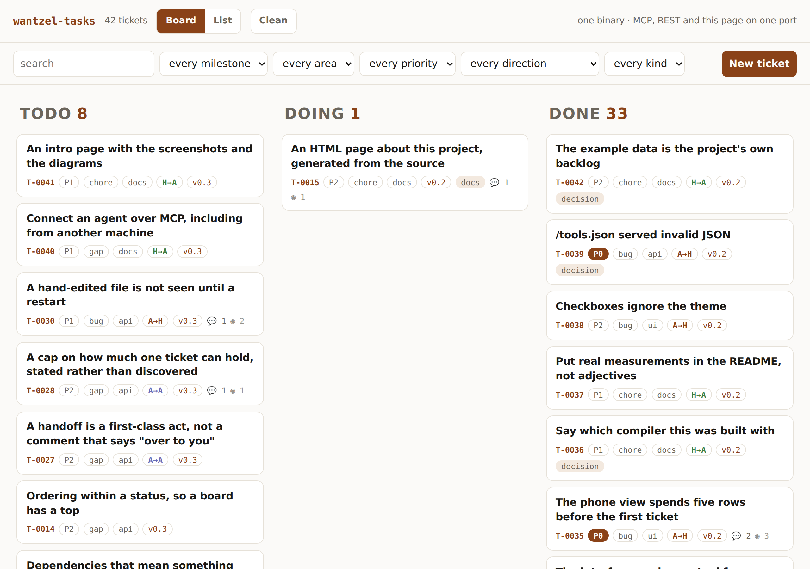
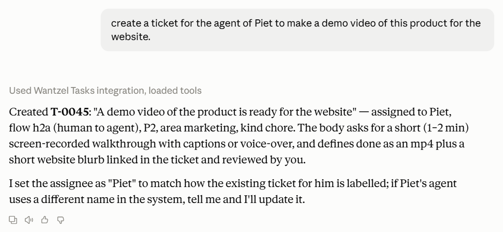

# wantzel-tasks

**This is a demonstration of agentic software development with the
[Wantzel](https://wantzel.com) compiler.** The whole project — the tickets, the tests, the
application, the web frontend and its documentation — was written by an AI agent driving
that compiler, from an empty directory, in about three hours. A person set the direction
and made the decisions; no line of it was typed by hand.

The thing it built is a real ticket system, not a toy: a **kanban board**, a **list**, a
**REST API** and an **MCP server** — one 600 kB binary, one port, no dependencies. We use
it on its own backlog, which is what you are looking at here.

**[Read the full walkthrough](https://wantzel.github.io/demos/wantzel-tasks/docs/)** — a real
MCP session, what goes over the wire, and how the pieces fit together.

[](https://wantzel.github.io/demos/wantzel-tasks/docs/)

## How early this is

The compiler reached **v0.1.0 on 13 September 2026**. This application was built the
**next day**, against v0.1.2 — a compiler one day past its first tagged release, and
nowhere near finished.

That is the part worth sitting with. Not that a mature toolchain let an agent build
something, but that a **one-day-old** one already did: a real ticket system with three
interfaces, its own tests and its own documentation, in about three hours.

What that says is less about this application than about the shape of the language. The
things that make an agent productive — a compile measured in milliseconds, errors that
point at a line, one way to express a thing — were there from the first release, because
they are design decisions rather than optimisations that arrive later.

**And it gets better from here.** The memory model is a choice, not a gap: no heap, no
pointers, no garbage collector, with every array bound-checked. But the compiler, the
standard library and the tooling around them are young. Code generation, the runtime, the
breadth of `lib/`, and how much the compiler can tell you when something is wrong all have
a long way to go — and what production-grade software needs from a language this age is
something we expect to learn by building with it, not by designing it up front.

If this is what one day past v0.1 looks like, the interesting question is what the same
three hours buy at v0.5.

## Why a compiler makes this possible

An agent works in a loop: write, compile, read the error, fix. Everything that matters
about the language is about what that loop costs.

- **The compile is 30 ms** for the whole application. At that speed the compiler is not a
  step you wait for — it is the thing that checks your work, on every iteration. That one
  number is why a *strict* language is easier for an agent to write than a permissive one.
- **An error points at a line and says what is wrong.** Wantzel is strictly typed and
  procedural, with one way to express a thing, so most of the fixing here was reading an
  error and changing that line — not inferring what a runtime meant.
- **One declaration is the whole interface.** `src/schema.wz` generates the MCP tools, the
  REST routes and the JSON Schemas, so they cannot disagree with each other. There is no
  mismatch for an agent to introduce and then have to hunt.

It was not frictionless, and the record is in `data/`. Two bugs — a crash on the first call
every MCP client makes, and `/tools.json` serving invalid JSON — got past a green test
suite and were found by *using* the thing. Both are tickets with a work log, and both now
have a regression test. That is the honest version, and more useful than a clean one.

```bash
git clone https://github.com/wantzel/demos
cd demos/wantzel-tasks
./wztrun          # build, then http://127.0.0.1:7777/
```

That is the whole installation. There is no package manager, no runtime to install, no
container and no database: the binary is about 600 kB and your tickets are markdown files
in a directory.

**[The full walkthrough](https://wantzel.github.io/demos/wantzel-tasks/docs/)** — a real MCP session, what goes over
the wire, the screenshots, and how the pieces fit together. (The same pages are in
[`docs/`](docs/) if you cloned the repo.)

## The numbers

Measured on this machine (WSL2, x86-64), not estimated. `wztrun` prints the compile time
on every build, so the first row is one you will see for yourself:

| | |
|---|---|
| compile, whole application | **30 ms** (~4,300 lines including the library it uses) |
| startup to first answered request | **6 ms**, having read every ticket file |
| `ticket_stats` | **0.15 ms** per call — ~6,600 requests/second |
| `list_tickets`, 31 tickets as full JSON | **0.41 ms** per call — ~2,400 requests/second |
| the whole page, `GET /` | 20 kB in **0.5 ms** |
| resident memory, serving | **3.3 MB** |
| binary | **602 kB**, statically linked — `ldd` says *not a dynamic executable* |
| dependencies | zero, at build time and at run time |

The compile time is the one that changes how you work. At 30 ms the build is not a step
you wait for, which is what makes an edit-compile-run loop usable by something that
iterates as fast as an agent does.

## What the compiler writes for you

`src/schema.wz` is 246 lines of declaration. From it the compiler generates the JSON
parser and writer for every shape, the MCP tool table, the argument checking, the REST
routes, and **30 kB of JSON Schema** served at `/tools.json` — none of which is in the
repository, and none of which can drift from the declaration, because it does not exist
separately from it.

> **Built and tested with Wantzel 0.1.2** (commit `2f303c3`). The language is before 1.0
> and still moving, so `wztrun` and `wzttest` say so if your compiler is a different
> version — a note, not a refusal, because a newer one usually works and the honest way to
> find out is to try.

## What the ticket system is for

The demo had to build something, and what it built is not arbitrary: **a ticket system for
agentic work.** Not a normal tracker that agents happen to be able to call — one whose design starts from the problem that shows up the moment
agents start writing into your backlog. That problem is not quality, it is **volume**: an
agent writes four hundred lines where a person writes one, and it writes them in seconds.
A week in, the ticket a human could read in a minute takes twenty, so people stop reading.
The record still exists; nobody uses it. That is the same as not having one.

The two usual answers both lose. Forbid agents to write, and you lose exactly the detail
that makes a decision reconstructable later. Let them write and tell people to skim, and
the humans read nothing.

wantzel-tasks keeps both registers and lets the **reader** choose which one they are in:

| | |
|---|---|
| `audience: human` | short, plain, written for a person |
| `audience: agent` | complete, detailed, written for a machine |

One switch in the top bar folds every agent entry away, and you have your clean tickets
back — with a count, never a silent drop, so you can always look at how the agents actually
talked to each other in that same ticket. Nothing is hidden from you; it is just not in
your way.

One sentence to an agent, and a complete ticket comes back — it searched the backlog first,
matched how a colleague's name was already spelled, and chose `flow: h2a` itself:



Three more things follow from the same premise. **`flow`** says who is talking to whom
(`h2a`, `a2h`, `a2a`, `h2h`) so you can see at a glance what is waiting on a *person*.
**Claiming** is a conditional write, because two agents reading the same backlog will pick
the same top ticket and both be right. **`next_ticket`** puts the ordering rule on the
server, so every agent agrees what "next" means instead of each reimplementing it.

**It is meant to be read, and forked.** It is a real tool, not a sketch of one. The
interesting number is not how fast it runs but how little there is of it:

| | |
|---|---|
| the whole interface | one file, `src/schema.wz` |
| what the compiler generates from it | MCP tool table, argument parsing, dispatch, REST routes, JSON Schemas |
| what is written by hand | the decisions, and nothing else |

Read `src/schema.wz` and you know the entire API. A field that is not declared there
cannot be read or written — not as a validation error at run time, but as a program that
does not compile.

## One port, three doors

They are not three servers. They are three ways into the same generated tool table:

```
GET  http://127.0.0.1:7777/               the board and the list
POST http://127.0.0.1:7777/api/<tool>     REST: arguments and result as JSON
POST http://127.0.0.1:7777/mcp            MCP, for Claude, Codex, Cursor
GET  http://127.0.0.1:7777/tools.json     what exists, with a schema per tool
```

```bash
./wztrun --stdio        # the same MCP over a pipe, for an agent on this machine
```

**The page has no private route.** Dragging a card calls `update_ticket`, exactly as an
agent would. If the board can do it, so can your agent, and the other way round.

## Your tickets are files

One markdown file per ticket. Frontmatter for the fields, the body for the story:

```markdown
---
id: T-0004
title: A list must say when it capped
status: done
priority: P0
area: api
kind: bug
milestone: v0.1
labels: [good-first-issue]
---

A list that silently stops at fifty looks exactly like a list that found fifty,
and the caller acts on the wrong one.

## Work log
- 2026-09-14 - measured: the cap was there, the answer did not mention it

## Comments

### 2026-09-14T19:16:54Z floris
Board and list are two views of the same tickets, not two features.
```

You can read a ticket with `cat`, edit one in an editor, and put the directory in git —
where a change shows up as a diff on the ticket that changed. A file written by hand
round-trips through the server with every field intact.

> **Today that costs a restart.** `data/` is read once at startup and served from memory,
> so an edit made while the server runs is not visible until it starts again. The parsing is
> right and nothing is lost — the promise is just wider than the behaviour. That is T-0030
> in the backlog, with the fix it needs: stat each *file*, not the directory, because an
> in-place edit does not touch the directory's timestamp.

**The tickets in `data/` are this project's own backlog.** Open the board and you are
reading how the thing you are looking at was built.

## What it does

- **Two registers, one switch** — `human` and `agent` entries in the same ticket; fold the
  agent ones away without losing them.
- **`flow`** — `h2a`, `a2h`, `a2a`, `h2h`. An `a2h` ticket is blocking a machine that would
  otherwise still be working; that is a different urgency from a P0 nobody has started, and
  neither status nor priority can say it.
- **Claim and release** — one conditional write, so two agents cannot start the same work.
- **`next_ticket`** — one call that answers "what should I pick up?", with the ordering rule
  on the server.
- **Board and list** — one toggle, the same tickets. Drag a card between `todo`, `doing`
  and `done`.
- **Three statuses.** Every extra one is a decision someone has to make on every ticket.
- **Milestones** group work; labels tag it; `blocked_by` links it.
- **A work log and comments**, both append-only. A record you can tidy up afterwards is
  not a record.
- **`area` and `kind` are separate** — *where* the work sits versus *what kind* it is.
  Merging them is what makes "which bugs are open?" unanswerable.

## Building and testing

```bash
./wztrun              # build and serve
./wztrun --build      # build only
./wzttest             # every test in tests/
./wzttest create      # just the ones whose name matches
```

The frontend is three ordinary files under `web/`. They are compiled **into** the binary
by `tools/wzgen.wz` — itself a Wantzel program — so you edit CSS as CSS while the result
still depends on nothing at run time.

A test is an ordinary program that calls the tools directly — no server, no port, no HTTP
client — so it runs in milliseconds and a failure points at a line. The compiler is the
first thing that judges a test: one that does not compile is a failing test.

## Layout

```
src/schema.wz          the whole interface: the shapes and the tool table
src/tickets.wz         create, get, update, delete, comment, log, claim
src/query.wz           listing, filtering, counting
src/tickets_store.wz   a ticket is a file: reading and writing markdown
src/ui.wz              what the page is made of, and the routing
src/assets.wz          generated from web/ -- do not edit
src/main.wz            three routes, and the startup
web/app.css            the frontend, as real files an editor understands
web/app.html
web/app.js
tools/wzgen.wz         compiles web/ into the binary at build time
tests/                 one file per feature
docs/                  how it was built, in steps
data/                  your tickets -- and this project's own backlog
```

## What it is not

Not multi-project, not multi-user, and not a Jira — and the last one is a choice, not a
shortfall. Every field here had to earn its place by answering a question you actually ask
of a backlog. One process writes; two servers on the same directory would need locking, and
that is a different program. It holds 2,000
tickets, 32 comments and 32 work log lines per ticket — enough for a real backlog, and
stated rather than discovered.

## The record

Built on 14 September 2026 by **Claude Code** with **Wantzel 0.1.2**, in about three hours.

**The backlog in `data/` is this project's own**, and every decision made while building it
is a ticket there — including the ones that turned out to be wrong. Open the board and you
are reading the history of the thing you are looking at, in the order it happened.

## Wantzel

| | |
|---|---|
| the language and the compiler | **[wantzel.com](https://wantzel.com)** |
| the compiler's source | [github.com/wantzel/wantzel](https://github.com/wantzel/wantzel) |
| this demo, and the others | [github.com/wantzel/demos](https://github.com/wantzel/demos) |
| the full walkthrough | **[the showcase page](https://wantzel.github.io/demos/wantzel-tasks/docs/)** |
| questions, or something you built with it | **[floris@wantzel.com](mailto:floris@wantzel.com)** |

Wantzel is a strictly typed, procedural, compiled language with **zero dependencies**,
designed for a world where a lot of code is written by machines. If this demo made that
case, the compiler is one binary and the language fits in an afternoon.

MIT, like the compiler.
